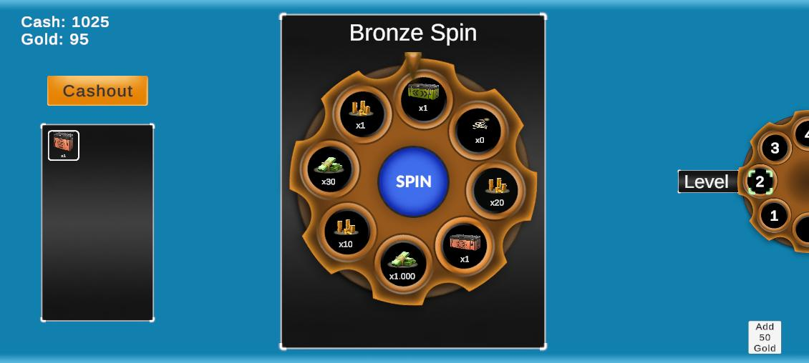
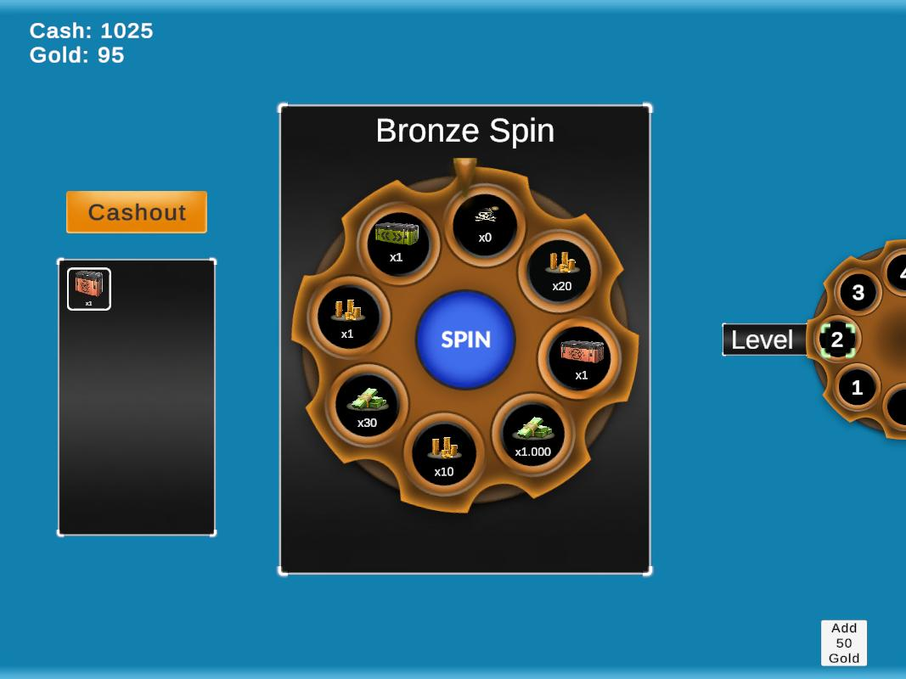

#  Vertigo Games Fortune Wheel Game Case

This project is a demo implementation of a **risk–reward wheel spin game**,
developed as part of the Vertigo Games Game Developer demo assignment.

The focus of this project is not only gameplay correctness but also
**clean architecture, maintainability, and scalability**.

---

## 🎮 Game Rules & Mechanics

- Each zone contains a wheel with multiple reward slices.
- **Bronze zones** include a **bomb** that wipes all pending rewards.
- Every **5th zone** is a **safe (silver) zone**:
  - No bomb
  - Risk-free spin
- Every **30th zone** is a **super (gold) zone**:
  - No bomb
  - Special rewards
- Rewards improve progressively with each zone.
- The player can **cash out** only when:
  - The wheel is not spinning
  - The zone is safe or a super zone
- If a bomb is hit:
  - All pending rewards are lost
  - The run ends
- An optional **continue system** allows players to recover after a bomb
  by spending in-game currency (bonus feature for demo purposes).

This creates a classic **gambling-style risk vs reward loop**.

---

## 🧱 Architecture Overview

The project is structured with clear separation of concerns:

- **View**
  - Handles UI, animations, and visual feedback only
- **Presenter**
  - Manages game flow, state transitions, and UI control
- **API Layer**
  - Simulates server-side logic and progression
- **Economy System**
  - Handles inventory updates and reward application
- **Config System**
  - Fully data-driven via ScriptableObjects
  - Wheel slice content is editable from the Unity Editor

This structure allows the feature to be easily extended, tested, or connected
to a real backend service.

---

## 🔄 Mock API Note

Although backend integration was not explicitly required for this demo,
the feature was implemented as if it were **server-driven**.

A lightweight **fake API** is included only to simulate:
- Server-side reward resolution
- Bomb logic
- Progression rules
- Continue and cashout flows

In a production scenario, this layer can be replaced directly with a real backend.

---

## 🧠 Design Principles

- SOLID principles
- Object-Oriented Programming
- Separation of concerns
- Data-driven design
- Reusable, maintainable, and scalable codebase

---

## 📦 Build & Delivery

- A playable **APK** is included:
  - In the `/Builds` folder
  - As a **GitHub Release** asset
- The full Unity project is available in this repository.
- Gameplay video and screenshots are included for review.

---

## 📱 Screenshots & Video

- Screenshots provided in:
  - 20:9
  - 16:9
  - 4:3 aspect ratios
- Short gameplay video demonstrates:
  - Normal spin
  - Bomb outcome
  - Cashout
  - Safe zone behavior
 
  

  
  
  
  

  ### 🎥 Gameplay Video & Apk
🔗 [Download APK & Watch Gameplay Video](https://github.com/exepoch/vertigo-games-fortune-wheel-game-case/releases/tag/v1.0)

